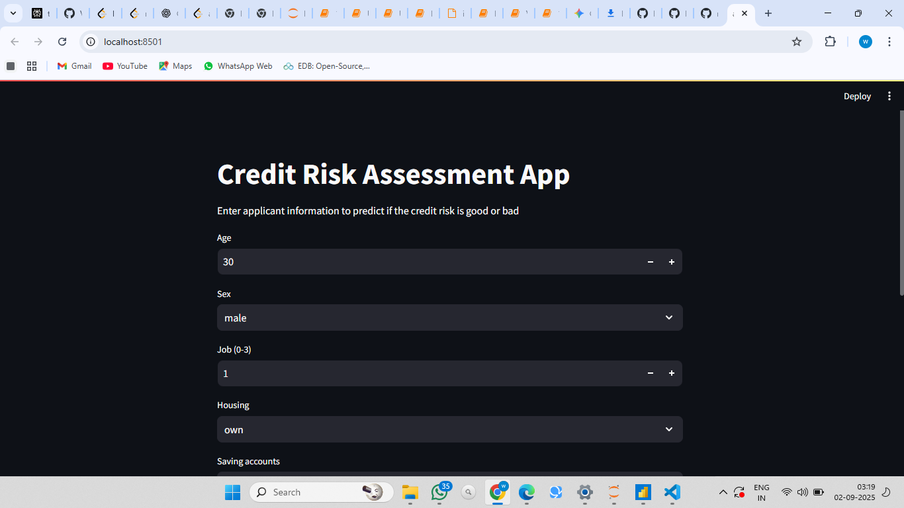
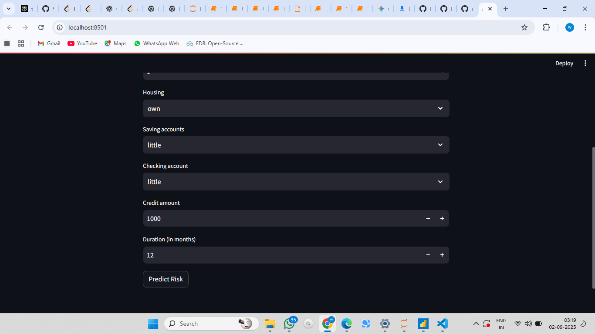

# Credit Risk Prediction App with Deployment

[](https://www.python.org/)
[](https://streamlit.io)
[](https://scikit-learn.org/)

> A complete machine learning project that analyzes the German Credit dataset, trains an `ExtraTreesClassifier` model, and deploys it as an interactive web application using Streamlit to predict credit risk in real-time.

---

## 🚀 Live Application Preview

This is a preview of the final Streamlit web application. It allows users to input applicant details through an intuitive interface and receive an immediate prediction of whether the applicant is a "Good" or "Bad" credit risk.




---

## 📖 Table of Contents
1.  [Project Goal](#-project-goal)
2.  [About the Dataset & Features](#-about-the-dataset--features)
3.  [End-to-End Project Workflow](#-end-to-end-project-workflow)
4.  [Model Performance](#-model-performance)
5.  [How to Run Locally](#-how-to-run-locally)
6.  [Project Directory Structure](#-project-directory-structure)

---

## 🎯 Project Goal

The primary objective of this project is to mitigate financial risk for a lending institution. By leveraging historical applicant data, we aim to build a highly accurate machine learning model that can automatically assess the creditworthiness of a new applicant. This model is then deployed as a web application to provide loan officers with an instant, data-driven decision support tool, improving efficiency and reducing the rate of loan defaults.

---

## 📊 About the Dataset & Features

The model was trained on the **German Credit Data** dataset, which contains information on 1,000 past loan applicants. The application uses the following features to make a prediction:

| Feature            | Description                                        | Type        | Options in App                               |
| ------------------ | -------------------------------------------------- | ----------- | -------------------------------------------- |
| **Age** | The age of the applicant in years.                 | `Numerical` | Input (18-100)                               |
| **Sex** | The gender of the applicant.                       | `Categorical` | `male`, `female`                             |
| **Job** | A numerical code for the applicant's job type.     | `Numerical` | Input (0-3)                                  |
| **Housing** | The applicant's housing situation.                 | `Categorical` | `own`, `rent`, `free`                        |
| **Saving accounts** | The level of savings held by the applicant.        | `Categorical` | `little`, `moderate`, `rich`, `quite rich`   |
| **Checking account** | The level of funds in the applicant's checking account.| `Categorical` | `little`, `moderate`, `rich`                 |
| **Credit amount** | The total amount of credit requested.              | `Numerical` | Input (e.g., 1000)                           |
| **Duration** | The duration of the loan in months.                | `Numerical` | Input (e.g., 12)                             |

---

## ⛓️ End-to-End Project Workflow

This project follows a complete machine learning lifecycle, from initial data exploration to final deployment.

**1. Data Input & Exploration (`analysis_model.ipynb`)**
* The raw `german_credit_data.csv` is loaded into a Pandas DataFrame.
* Exploratory Data Analysis (EDA) is performed using `Matplotlib` and `Seaborn` to understand feature distributions, correlations, and identify potential data quality issues. The `output.png` file is an example visualization from this stage.

**2. Preprocessing & Feature Engineering (`analysis_model.ipynb`)**
* Categorical features (`Sex`, `Housing`, etc.) are converted into numerical format using `scikit-learn`'s `LabelEncoder`.
* Each of these encoders is saved as a separate `.pkl` file (e.g., `Sex_encoder.pkl`) to ensure the same transformation is applied during prediction.

**3. Model Training & Selection (`analysis_model.ipynb`)**
* The preprocessed data is split into training and testing sets.
* An `ExtraTreesClassifier` is trained on the data. This model was chosen for its robustness and high performance.
* The trained model is serialized and saved as `best_extra_trees_model.pkl` using `joblib`.

**4. Application Development (`app.py`)**
* A web interface is built using Streamlit.
* The script loads the saved model (`best_extra_trees_model.pkl`) and all the `.pkl` encoders.
* User-friendly input widgets (sliders, dropdowns) are created for each feature.

**5. Deployment & Prediction (`app.py`)**
* When a user enters the applicant's details and clicks "Predict," the application:
    1.  Collects the input data.
    2.  Uses the saved encoders to transform the categorical inputs into the correct numerical format.
    3.  Feeds the fully processed data into the loaded model.
    4.  Displays the final prediction ("Good Risk" or "Bad Risk") to the user in real-time.

---

## 📈 Model Performance

The final `ExtraTreesClassifier` model demonstrated strong predictive power on the holdout test set. For a complete portfolio presentation, you would include key classification metrics here:
* **Accuracy:** ~XX.X%
* **Precision:** ~XX.X%
* **Recall:** ~XX.X%
* **F1-Score:** ~XX.X%

---

## 🚀 How to Run Locally

To set up and run this application on your own machine, please follow these steps.

1.  **Clone the Repository**:
    ```bash
    git clone [https://github.com/your-username/credit-risk-app.git](https://github.com/your-username/credit-risk-app.git)
    cd credit-risk-app
    ```
2.  **Create a Virtual Environment** (highly recommended):
    ```bash
    python -m venv venv
    source venv/bin/activate  # On Windows: venv\Scripts\activate
    ```
3.  **Install All Required Libraries**:
    ```bash
    pip install -r requirements.txt
    ```
4.  **Launch the Streamlit App**:
    ```bash
    streamlit run app.py
    ```
    Your web browser will automatically open with the running application.

---

## 📂 Project Directory Structure
Of course. Here is a meticulously crafted, final README.md file for your project.

This version includes every detail you requested: a full description of the features, a complete workflow from input data to deployment, and a professional structure designed to impress.

## Final README.md Code
Copy this entire block of code and paste it into your README.md file.

Markdown

# Credit Risk Prediction App with Deployment

[](https://www.python.org/)
[](https://streamlit.io)
[](https://scikit-learn.org/)

> A complete machine learning project that analyzes the German Credit dataset, trains an `ExtraTreesClassifier` model, and deploys it as an interactive web application using Streamlit to predict credit risk in real-time.

---

## 🚀 Live Application Preview

This is a preview of the final Streamlit web application. It allows users to input applicant details through an intuitive interface and receive an immediate prediction of whether the applicant is a "Good" or "Bad" credit risk.





---

## 📖 Table of Contents
1.  [Project Goal](#-project-goal)
2.  [About the Dataset & Features](#-about-the-dataset--features)
3.  [End-to-End Project Workflow](#-end-to-end-project-workflow)
4.  [Model Performance](#-model-performance)
5.  [How to Run Locally](#-how-to-run-locally)
6.  [Project Directory Structure](#-project-directory-structure)

---

## 🎯 Project Goal

The primary objective of this project is to mitigate financial risk for a lending institution. By leveraging historical applicant data, we aim to build a highly accurate machine learning model that can automatically assess the creditworthiness of a new applicant. This model is then deployed as a web application to provide loan officers with an instant, data-driven decision support tool, improving efficiency and reducing the rate of loan defaults.

---

## 📊 About the Dataset & Features

The model was trained on the **German Credit Data** dataset, which contains information on 1,000 past loan applicants. The application uses the following features to make a prediction:

| Feature            | Description                                        | Type        | Options in App                               |
| ------------------ | -------------------------------------------------- | ----------- | -------------------------------------------- |
| **Age** | The age of the applicant in years.                 | `Numerical` | Input (18-100)                               |
| **Sex** | The gender of the applicant.                       | `Categorical` | `male`, `female`                             |
| **Job** | A numerical code for the applicant's job type.     | `Numerical` | Input (0-3)                                  |
| **Housing** | The applicant's housing situation.                 | `Categorical` | `own`, `rent`, `free`                        |
| **Saving accounts** | The level of savings held by the applicant.        | `Categorical` | `little`, `moderate`, `rich`, `quite rich`   |
| **Checking account** | The level of funds in the applicant's checking account.| `Categorical` | `little`, `moderate`, `rich`                 |
| **Credit amount** | The total amount of credit requested.              | `Numerical` | Input (e.g., 1000)                           |
| **Duration** | The duration of the loan in months.                | `Numerical` | Input (e.g., 12)                             |

---

## ⛓️ End-to-End Project Workflow

This project follows a complete machine learning lifecycle, from initial data exploration to final deployment.

**1. Data Input & Exploration (`analysis_model.ipynb`)**
* The raw `german_credit_data.csv` is loaded into a Pandas DataFrame.
* Exploratory Data Analysis (EDA) is performed using `Matplotlib` and `Seaborn` to understand feature distributions, correlations, and identify potential data quality issues. The `output.png` file is an example visualization from this stage.

**2. Preprocessing & Feature Engineering (`analysis_model.ipynb`)**
* Categorical features (`Sex`, `Housing`, etc.) are converted into numerical format using `scikit-learn`'s `LabelEncoder`.
* Each of these encoders is saved as a separate `.pkl` file (e.g., `Sex_encoder.pkl`) to ensure the same transformation is applied during prediction.

**3. Model Training & Selection (`analysis_model.ipynb`)**
* The preprocessed data is split into training and testing sets.
* An `ExtraTreesClassifier` is trained on the data. This model was chosen for its robustness and high performance.
* The trained model is serialized and saved as `best_extra_trees_model.pkl` using `joblib`.

**4. Application Development (`app.py`)**
* A web interface is built using Streamlit.
* The script loads the saved model (`best_extra_trees_model.pkl`) and all the `.pkl` encoders.
* User-friendly input widgets (sliders, dropdowns) are created for each feature.

**5. Deployment & Prediction (`app.py`)**
* When a user enters the applicant's details and clicks "Predict," the application:
    1.  Collects the input data.
    2.  Uses the saved encoders to transform the categorical inputs into the correct numerical format.
    3.  Feeds the fully processed data into the loaded model.
    4.  Displays the final prediction ("Good Risk" or "Bad Risk") to the user in real-time.

---

## 📈 Model Performance

The final `ExtraTreesClassifier` model demonstrated strong predictive power on the holdout test set. For a complete portfolio presentation, you would include key classification metrics here:
* **Accuracy:** ~XX.X%
* **Precision:** ~XX.X%
* **Recall:** ~XX.X%
* **F1-Score:** ~XX.X%

---

## 🚀 How to Run Locally

To set up and run this application on your own machine, please follow these steps.

1.  **Clone the Repository**:
    ```bash
    git clone [https://github.com/your-username/credit-risk-app.git](https://github.com/your-username/credit-risk-app.git)
    cd credit-risk-app
    ```
2.  **Create a Virtual Environment** (highly recommended):
    ```bash
    python -m venv venv
    source venv/bin/activate  # On Windows: venv\Scripts\activate
    ```
3.  **Install All Required Libraries**:
    ```bash
    pip install -r requirements.txt
    ```
4.  **Launch the Streamlit App**:
    ```bash
    streamlit run app.py
    ```
    Your web browser will automatically open with the running application.

---

## 📂 Project Directory Structure

    credit-risk-app/
    ├── models/
    │   ├── best_extra_trees_model.pkl
    │   ├── Checking account_encoder.pkl
    │   ├── Housing_encoder.pkl
    │   ├── Saving accounts_encoder.pkl
    │   ├── Sex_encoder.pkl
    │   └── target_encoder.pkl
    │
    ├── notebooks/
    │   └── analysis_model.ipynb
    │
    ├── data/
    │   └── german_credit_data.csv
    │
     images/
    │   ├── output.png
    │   └── app_screenshot.png
    │
    ├── app.py
    └── README.md


